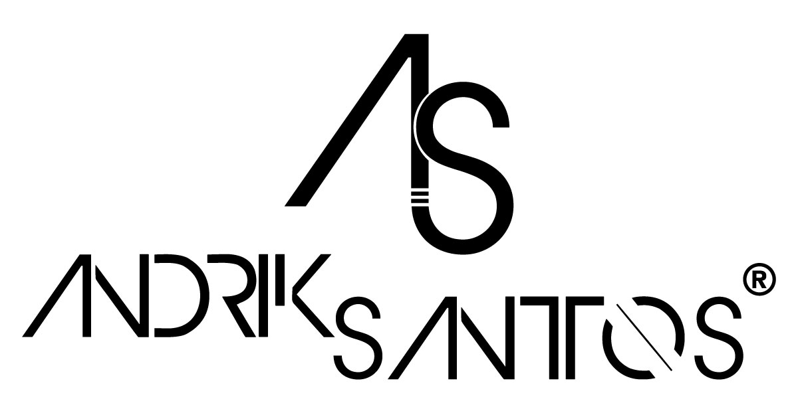

 

---

## About
__Andrik Santos - Certificates__
Official website where i show my gallery of certifications... A computer scientist with certain skills such as Web Development, Computer Security, Applications Development and Graphic Design, apart from that, I like to optimize processes, always on the way to innovation

## Web Site
[Andrik Santos](https://andriksantos.github.io)

## Social Network
- [Facebook](https://www.facebook.com/andrik.rsm)
- [Instagram](https://www.instagram.com/andriksantos12)
- [Twitter](https://www.twitter.com/andrik_rsm)
- [Linkedin](https://www.linkedin.com/in/andriksantos)

## Credits:
  - Icons:
    - Font Awesome (fontawesome.io)

- Other:
  - jQuery (jquery.com)
  - Poptrox (github.com/ajlkn/jquery.poptrox)
  - Responsive Tools (github.com/ajlkn/responsive-tools)